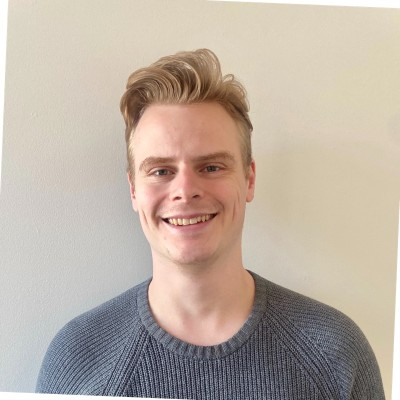

💼 <a href="https://www.linkedin.com/in/efredin/" target="_blank">LinkedIn</a> 
🧑‍💻 <a href="https://github.com/erikfredin" target="_blank">GitHub</a> 
📧 <a href="mailto:erik.fredin98@gmail.com">erik.fredin98@gmail.com</a>

<h1 style="font-size: 2.6rem; margin-bottom: 0.2rem;">

  <a href="/" style="text-decoration: none; color: inherit;">
    Erik Fredin
  </a>

  
    |
    <a href="./resume">Resume</a> |
    <a href="./projects">Projects</a> |
    <a href="./publications">Publications</a>
  

</h1>

<strong>Ph.D. Student in Robotics and Computer Vision</strong> | Toronto, ON

<!--

<a href="./resume">Resume</a> |
<a href="./projects">Projects</a> |
<a href="./publications">Publication List</a>

 -->

Hi there! I'm Erik, a final-year PhD candidate at the University of Toronto. I am passionate about robotics and machine learning, and have researched computer vision for medical robotics during my PhD.

Previously, I participated in the design team “Formula Student Driverless” at Lund University, Sweden. I also completed a project at Volvo Cars, where I developed software to control simulated autonomous vehicles in various traffic scenarios.

My current interests are computer vision and machine learning. I also love problem solving, programming and working in teams to design and build complex engineering systems.

