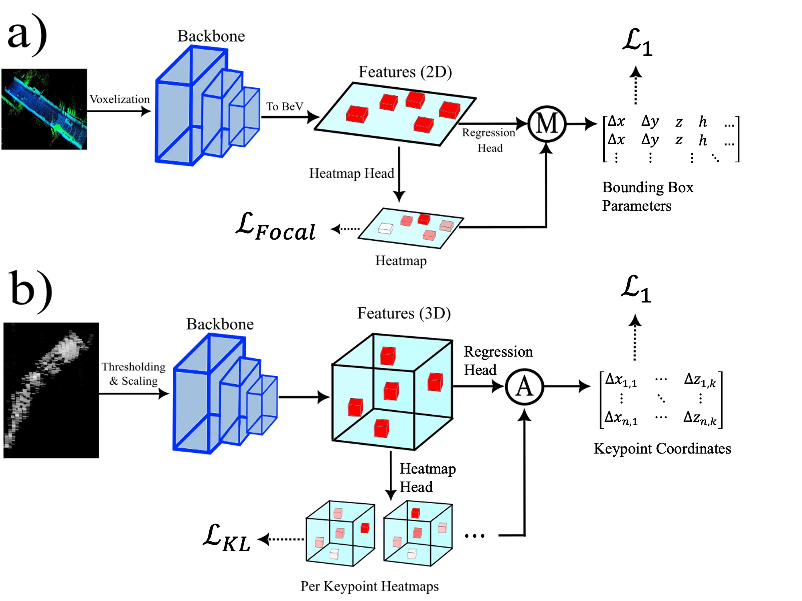

<h1 style="font-size: 2.6rem; margin-bottom: 0.2rem;font-family: 'Georgia', serif;">

  <a href="/" style="text-decoration: none; color: inherit;">
    Erik Fredin
  </a>

  
    |
    <a href="./Resume.pdf" style="color: black">Resume</a> |
    <a href="./projects" style="color: black">Projects</a> |
    <a href="./publications" style="color: black">Publications</a>
  

</h1>
# 🚀 Projects

### *Robot Pose Estimation in Medical (OCT) Images*
  
<!-- 
*a) VoxelNeXt architecture from orignal paper, b) VoxelNeXt architecture for pose estimation in OCT images* \
🎥 Demo (GIF):  
 -->

<!--📹 Video Demo:-->  
<video src="./assets/oct-video.mp4" controls width="600"></video>

<!--📝 Description:-->  
This is project was a collaboration between my lab and another lab at the University of Toronto. We estimate the 8 degree-of-freedom pose of a small surgical robot in medical (OCT) images. To achieve this, I reworked the architecture of a deep-learning model originally designed for detecting objects in LiDAR scans. The model leverages a keypoint detection approach to estimate the pose very accurately (5 degree joint angle error, 0.6 mm position error). We also used pose estimation to control the robot for performing a simple task, specifically picking up and dropping off a tube. Using pose estimation to do this task (closed loop) outperforms conventional control without pose estimation (open-loop).

🔗 Links:
- 🌐 [Publication](https://ieeexplore.ieee.org/abstract/document/11297825)    
- 📜 [Paper PDF](https://github.com/yourusername/project1)  
- 🖥️ [Project Website (incl. code)](https://medcvr.utm.utoronto.ca/ral2025-oct-pose.html)  

---

### *Computer Vision via Endoscopic Cameras*
**Tech:** Python, Flask  

📸 Screenshot:  

🎥 Demo (GIF):  

📹 Video Demo:  
<video src="./assets/project2-demo.mp4" controls width="600"></video>

📝 Description:  
Brief explanation.

🔗 Links:  
- GitHub: https://github.com/yourusername/project2  

---
### *Pioneering a driverless racecar | Lund Formula Student*

### *Autonomous vehicle simulations | Volvo Cars*